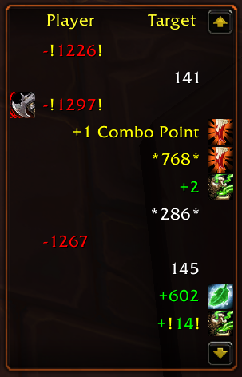
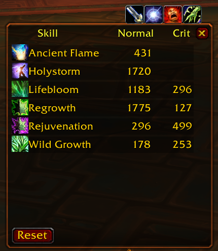
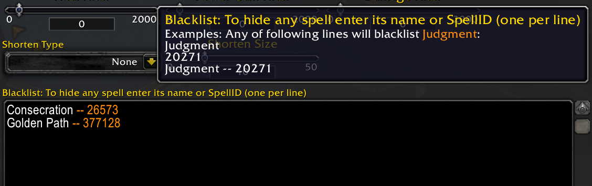

[](https://github.com/spamwax/EavesDrop/actions)
[](https://github.com/sponsors/spamwax?frequency=one-time)

<p>
</p>

This is my attempt to keep [Grayhoof](https://www.wowinterface.com/downloads/author-14368.html)'s addon alive.

The goal is to make it work under latest game version (currently 11.x). Please report any issues or bugs on the project's [Github page](https://github.com/spamwax/EavesDrop).

## What does it do?
A simple combat log that shows events (such as damage, heal, buff/debuff...), using icons and colors to make it easy to find
important information by a quick skim. It separates incoming events (left side) from outgoing events (right side) from misc. events (middle).

Additionally, it keeps track of each spell's maximum *normal* and **critical** hits!

----

## Usage
All events related to player will be shown in 3 columns. After each combat, a summary of incoming and outgoing heals and damage will be displayed.

- Shift+scroll up/down will show the top/bottom of events.
- Ctrl+scroll up/down will take you to the next/previous combat.
- Shift+Click will copy the highlighted event to the chat edit box
- Click the "*sun clock*" icon, to open history of highest values of all events, divided into healing and damage.

To customize the events (buff, debuffs, colors, values, ...), open the options window by right-click on the `EavesDrop` tab or entering slash command: `/ed`.

You can adjust the minimum damage/healing values in the options windows under **Misc** tab.

You can also completely exclude spells under the same tab. Enter the unwanted spell names or IDs in the **Blacklist** box, one spell per line. Any of the following lines will exclude *Judgment*:

```
Judgment
20271
Judgment -- 20271
```

<p>

----

## Installation
### Using addon managers

Install [wago.iop app](https://addons.wago.io/app) or [CurseForge](https://download.curseforge.com/) and search for `EavesDrop` in the apps to install the addon.

### Manual Installation

Download the `EavesDrop.zip` file from either [wago.io](https://addons.wago.io/addons/eavesdrop) or [github.com](https://github.com/spamwax/EavesDrop/releases/latest).
Then follow these instructions:

1. Go into your WoW installation folder (e.g. `C:\Program Files (x86)\World of Warcraft\_retail_`).
2. Go into the `Interface` sub-folder.
3. Go into the `AddOns` sub-folder (if you don't have one, create it).
4. Copy/Extract this addon's folder into the `AddOns` folder.
5. Make sure the folder name is `EavesDrop`.

#### Verification

  The following folder paths will exist within your WoW Install directory:

```sh
    Interface\AddOns\EavesDrop\
    Interface\AddOns\EavesDrop\libs\
    Interface\AddOns\EavesDrop\locals\
```

  Look for the following (wrong) files as evidence of common mistakes:

  * If you have `Interface\AddOns\EavesDrop.toc`
    then you've extracted the zip file's contents without its
        folder structure, or copied the contents without the parent
        folder.
  * If you have `Interface\AddOns\EavesDrop\EavesDrop\EavesDrop.toc`
        then you've extracted the zip file into a folder an extra
        level deep. Move the files and any sub-folders up one level
        and remove the extra folder.
  * If you have `Interface\AddOns\EavesDrop-2.8\` or similar, you need to rename it to `EavesDrop`.

For more detailed instructions see [wowointerfaces](http://www.wowinterface.com/forums/faq.php?faq=install#faq_howto_install)'s FAQ.

----

Original [FAQ/Notes](misc/old_readme.md) by Grayhoof.
